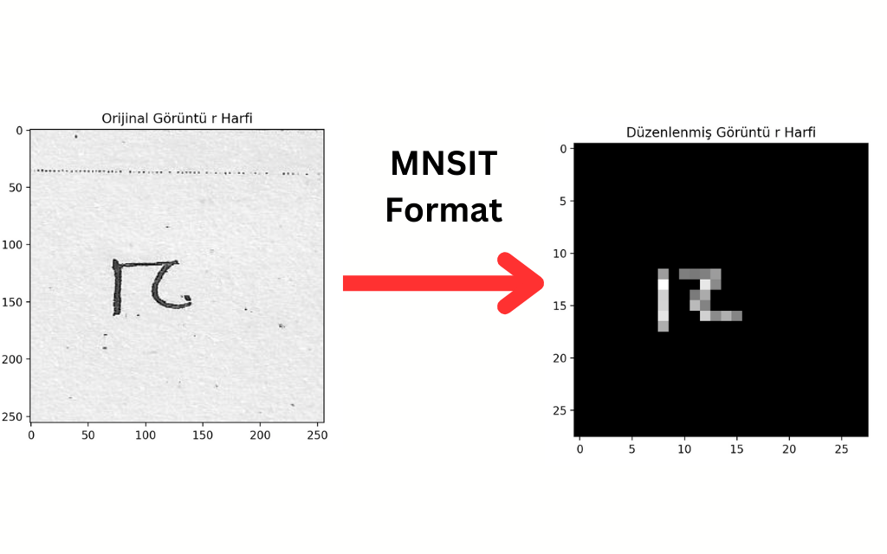

# Number and Letter Recognition

## Description

This project is a simple number and letter recognition program. It uses MNIST and Alphabet dataset to train a neural network, Decision Tree, Random Forest, Logistic Regression and KNN to recognize handwritten numbers and letters. The program is written in Python and uses the sklearn library to build the Machine Learning model. The program then asks the user to draw a number or letter in a window or upload an image. The program then uses the model to predict which number or letter the user has drawn.

## Installation

```bash
conda create -n number_letter_recognition python=3.9
conda activate number_letter_recognition
```

- If you don't have conda installed you can download it [here](https://docs.conda.io/projects/conda/en/latest/user-guide/install/windows.html).
- If you don't want to use conda to install environment you can use venv. You can get information about venv [from here](https://docs.python.org/3/library/venv.html).
- Then you can install the necessary libraries with the following command.

```bash
pip install -r requirements.txt
```

## Data folder structure

The data is not in this repository. You can download the data from kaggle ([click here](https://www.kaggle.com/datasets/lopalp/alphanum/data) for alphabet dataset and [click here](https://www.kaggle.com/datasets/hojjatk/mnist-dataset) for mnist dataset). After downloading the data, you can create the following folder structure and put the data in the appropriate folders. You will also use the alphabet_extractor.py and mnist_extractor.py files to extract the data. You don't need to train the models again. You can use the models in the models folder.

```bash
data/
├── alphabet/
│   ├── train/
│   │   ├── a
│   │   ├── b
│   │   ├── c
│   │   └── ...
│   ├── validation/
│   │   ├── a
│   │   ├── b
│   │   ├── c
│   │   └── ...
│   └── test/
│       ├── a
│       ├── b
│       ├── c
│       └── ..
└── mnist/
    ├── training
    ├── 0
    ├── 1
    ├── 2
    ├── ...
    ├── testing
    ├── 0
    ├── 1
    ├── 2
    └── ...
alphabet_extractor.py
mnist_extractor.py
```

#### To extract the MNIST dataset

```bash
python mnist_extractor.py
```

- The Mnist dataset contains 70,000 images of size 28x28. There are 60,000 training images and 10,000 test images. Each image has a label representing a number between 0 and 9.
- We process the data by applying erosion. This is because the images in the Alphabet dataset are thinner than the images in the MNIST dataset. So we thin the digits in the MNSIT dataset and have similar distributional properties to the images in the Alphabet dataset.


### To extract the alphabet dataset

```bash
python alphabet_extractor.py
```

- Each image in the Alphanet dataset has a size of 256x256 pixels.
- We then resize these images to 28x28 pixels. This is because smaller images train faster. Also, using the same size as the MNIST dataset makes it easier to combine the training and test data later on.
- In addition, we make the images grayscale (background black with white text). This is done to make it easier to process the images later and to bring them into the same format as the MNIST dataset



## Data preprocessing

- Here the data is combined and then split into training and test data. We also normalize the data. Normalization converts the data into a value between 0 and 1. This is then done to train the training data faster.

```bash
python preprocessing.py
```

## To train all Models

```bash
python train.py
```

- This command trains all models using the training data and then saves the models. It also sorts the models in order of accuracy from best to worst.

## To train the best model

```bash
python best_model_train.py
```

## Plot the results

- See result.ipynb file for graphs.

## Testing and Interface

```bash
python test.py
```

- This command asks the user to draw a number or letter in a window or to upload an image. The program then uses the best model to guess which number or letter the user drew.

#### Interface Examples

